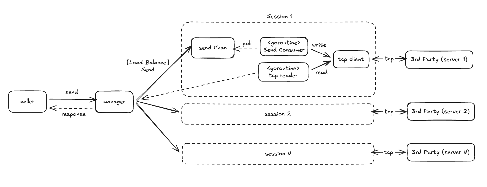

# TCP Butler

TCP Butler is a Go helper for building request/response style protocols on top of raw TCP sessions.



## Overview

The library exposes a `manager` that owns a pool of TCP sessions (either outbound via `NewClientManager` or inbound via `NewServerManager`). It handles:

- Establishing and reconnecting sessions per endpoint.
- Accepting inbound connections from one or more listeners.
- Tracking inflight requests and matching responses by correlation ID.
- Dispatching unsolicited inbound messages through a user-provided handler.
- Configurable buffering, reconnect backoff, and request timeouts.

You provide a `Message` type (`CorrelationID()` + `Encode()`), a `Decoder`, and any application logic you need.

## Use cases

### Send request and wait for response

```go
ctx := context.Background()
mgr, _ := tcpbutler.NewClientManager(ctx, []tcpbutler.ClientEndpoint{
    {
        Dial:        tcpbutler.TCPDial("127.0.0.1:9000", time.Second),
        Decoder:     myDecoder,
        NumSessions: 2,
    },
})
resp, err := mgr.SendAndWait(ctx, myMessage)
```

### Accept request and respond back

```go
ln, _ := net.Listen("tcp", ":9000")
mgr, _ := tcpbutler.NewServerManager(context.Background(), ln, myDecoder)
mgr.SetInboundHandler(func(ctx context.Context, msg tcpbutler.Message) (tcpbutler.Message, error) {
    return handleRequest(msg)
})
```

### Fire-and-forget outbound

```go
_ = mgr.SendNoWait(ctx, msg)
```

### Fire-and-forget inbound

```go
mgr.SetInboundHandler(func(ctx context.Context, msg tcpbutler.Message) (tcpbutler.Message, error) {
    go processAsync(msg)
    return nil, nil
})
```

## Configuration options

| Option | Description |
| --- | --- |
| `WithOutboundBuffer(size)` | Size of per-session outbound channel (default 100). |
| `WithMaxDialBackoff(d)` | Maximum reconnect backoff (default 30s). |
| `WithRequestTimeout(d)` | `SendAndWait` timeout before failing (default 5s). |

Pass these options to both `NewClientManager` and `NewServerManager` to tailor behavior per deployment.
